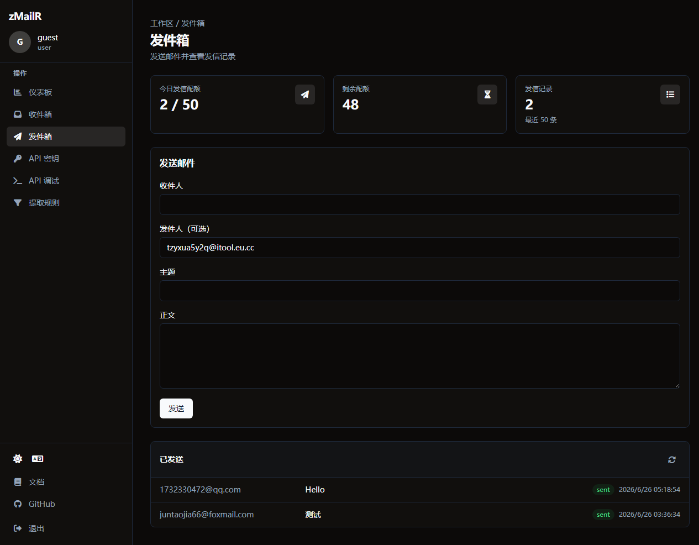
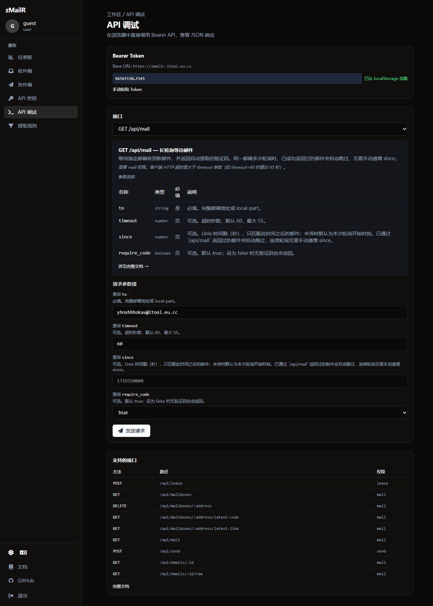
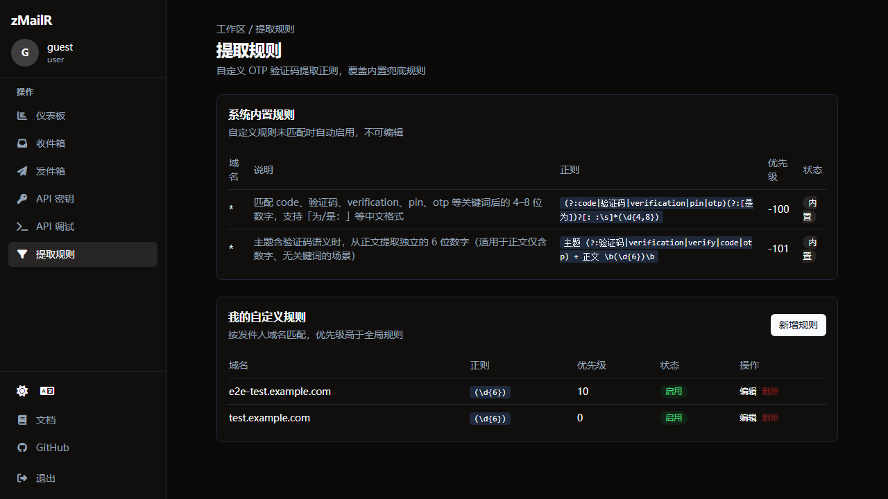

# <div align="center">zMailR · 24 小时临时邮箱服务</div>

<div align="center">
  <p>
    <a href="./README.en.md">English</a> | <strong>简体中文</strong>
  </p>

  <p><strong>Enhanced fork of <a href="https://github.com/zaunist/zmail">zaunist/zmail</a></strong>（MIT License）</p>

  <p>
    <a href="https://zmailr.itool.eu.cc/" target="_blank"><strong>在线体验</strong></a>
  </p>
</div>

---

## 项目简介

**zMailR** 是基于 Cloudflare Workers + D1 部署的**开源、可自托管**临时邮箱服务，定位类似 [MailSink](https://mailsink.dev/docs/) 的「收信 + OTP 提取」自动化能力，但以自托管与出站发信为差异化：用户可在 Web 界面一键生成 24 小时有效地址并实时收信；开发者通过 Bearer Token 完成「租用邮箱 → 长轮询收信 → 提取验证码 → 可选 Brevo 发信」。与 MailSink 的功能对照见 [docs/mailsink-comparison.md](docs/mailsink-comparison.md)。

**技术栈**：Cloudflare Workers、D1、Email Routing（入站）、Brevo Transactional API（出站发信）、React + Vite 前端。

---

## 功能特性

### Web 前端

- 随机生成 24 小时临时邮箱，支持多域名切换
- 邮件列表与详情、HTML/纯文本正文、附件下载
- 自动识别验证码并在界面高亮展示（OtpBox），一键复制
- 邮件自动刷新、删除邮箱、明暗主题
- 多语言界面（简体中文、English）
- 内置 [API 文档页](/api-docs)（`/api-docs`）

### 入站邮件

- Cloudflare Email Routing Catch-all → Worker 解析 MIME（postal-mime）
- 入库 D1，支持附件存储与下载
- 按发件人域名匹配**自定义提取规则**，未命中时回退**内置规则**，自动提取验证码字段

### 出站发信

- `POST /api/send` 通过 **Brevo** 发送事务邮件（默认发件人 `no-reply@你的域名`；可选 `from` 使用已租用的临时邮箱地址）
- 完整配置见 [docs/brevo-setup.md](docs/brevo-setup.md)

### 程序化 API

登录后在 **Dashboard → API Keys** 创建 Token（每位用户限 1 个，可选 scope：lease / mail / send）。Legacy 无配额 Token 仍可在 `/admin` 创建。请求头：`Authorization: Bearer <token>`。

| 端点 | 权限 | 说明 |
|------|------|------|
| `POST /api/lease` | lease | 租用随机临时邮箱，返回完整地址与过期时间 |
| `GET /api/mailboxes` | mail | 列出当前 Token 关联的活跃邮箱 |
| `GET /api/mailboxes/:address/latest-code` | mail | 非阻塞查询最新验证码 |
| `GET /api/mailboxes/:address/latest-link` | mail | 从最新邮件提取验证链接 |
| `GET /api/mail?to=...` | mail | 长轮询等待新邮件（默认最长 60s），返回 `code` 与邮件摘要 |
| `GET /api/emails/:id/raw` | mail | 下载原始 `.eml`（Bearer 或登录会话 + 所有权） |
| `POST /api/send` | send | 发送邮件（`to`、`subject`、`text`/`html`；可选 `from` 指定已租用邮箱） |
| `GET /api/user/quota` | 任意用户 Token 或会话 | 查询今日发信配额与剩余次数 |
| `DELETE /api/mailboxes/:address` | mail | 按 local-part 删除邮箱（会话所有者或 Bearer + 所有权） |

响应头含 `X-RateLimit-Limit` / `X-RateLimit-Remaining`（默认 60 次/分钟/Token）。完整说明见 [`/api-docs`](/api-docs) 或 Dashboard API Keys 页。

`/api/mail` 要点：

- `to`：完整邮箱或 local-part
- `timeout`：1–55 秒（默认 60）
- `since`：Unix 时间戳，只匹配此时间之后的邮件
- `require_code=false`：不要求提取到验证码也可返回
- **游标（cursor）**：同一邮箱多次轮询时，已返回过的邮件不会重复匹配

### 管理后台（`/admin`）

- 仪表盘：今日收信/发信、有效 Token、启用规则数
- API Token 的创建与吊销（legacy，无配额限制）
- **用户管理**：创建用户、设置日发信配额、重置密码
- 验证码提取规则（内置规则只读 + 自定义正则）
- 发信日志

### 用户认证（Phase 1）

- Web 发信与 Dashboard 功能需登录；**所有程序化 API 均需 Bearer Token**（用户 Token 或 `/admin` 创建的 legacy Token）
- 匿名 `POST /api/mailboxes` 已废弃，请登录后在收件箱创建，或使用 `POST /api/lease`（需 `lease` scope）
- 用户可创建带 scope（lease / mail / send）的 API Token
- 详见 [docs/user-auth.md](docs/user-auth.md)

### 运维

- GitHub Actions 推送 `main` 自动部署至 Cloudflare Workers
- 定时任务清理过期邮箱、过期邮件及已读邮件

---

## 使用指南

**在线演示**：[https://zmailr.itool.eu.cc/](https://zmailr.itool.eu.cc/) · 账号 `guest` / `guest`

登录后进入 Dashboard，左侧边栏可切换各功能区。

### 登录


访问首页会跳转至登录页。演示站使用 `guest` / `guest` 登录，成功后自动进入仪表板。

### 仪表板（`/dashboard/usage`）


展示当前用户的个人信息、API Token 状态、收件箱/发件箱用量统计与今日发信配额。

### 收件箱（`/dashboard/inbox`）


- 点击 **新建收件箱** 生成 24 小时临时地址（支持多域名切换）
- 实时展示邮件列表；正文中的验证码由提取规则自动识别并在 **OTP** 列高亮
- 支持查看邮件详情、HTML/纯文本正文与附件

### 发件箱（`/dashboard/outbox`）



- 顶部显示今日发信配额（已用 / 总额）与剩余配额
- 填写收件人、可选发件人、主题与正文即可发送
- 下方列表展示最近发信记录及状态

### API 密钥（`/dashboard/api-keys`）


- 每位用户限 **1 个** Bearer Token，可选 scope：`lease` / `mail` / `send`
- 创建时 Token 明文**仅显示一次**，可 **一键复制**；若丢失需删除后重新创建
- 页面提供 curl 示例与完整 API 文档链接

### API 调试（`/dashboard/api-debug`）



- 浏览器内直接调用 Bearer API，查看 JSON 响应与速率限制头
- 自动加载 localStorage 中保存的 Token；也可手动粘贴
- 切换接口时，邮箱地址等参数会从当前活跃邮箱 **自动预填**

### 提取规则（`/dashboard/extract-rules`）



- 上方展示**系统内置规则**（只读，作为兜底）
- **我的自定义规则**：按发件人域名匹配正则，优先级高于内置规则
- 支持新增、编辑、删除（用户级隔离，仅影响当前账号收到的邮件）

### 程序化 API 验证

```bash
pip install requests
python scripts/verify_api.py \
  --base-url https://zmailr.itool.eu.cc \
  --token <your-bearer-token> \
  --send-test
```

脚本流程：`POST /api/lease` 租用邮箱 → `POST /api/send` 发送含验证码的测试邮件 → `GET /api/mail` 长轮询提取验证码。

---

## 快速部署

1. **Fork** 本仓库到你的 GitHub 账户
2. 在 Cloudflare Dashboard 创建 **D1 数据库**，记录 `database_id` 与 `database_name`
3. 在仓库 **Settings → Secrets and variables → Actions** 中添加以下 Secret：

| Secret | 说明 |
|--------|------|
| `CF_API_TOKEN` | Cloudflare API Token（[创建](https://dash.cloudflare.com/profile/api-tokens)，使用 Edit Cloudflare Workers 模板） |
| `CF_ACCOUNT_ID` | Cloudflare 账户 ID（Workers 页面右侧） |
| `D1_DATABASE_ID` | D1 数据库 ID |
| `D1_DATABASE_NAME` | D1 数据库名称 |
| `VITE_EMAIL_DOMAIN` | 邮箱域名，多个用逗号分隔（如 `example.com,test.com`） |
| `ADMIN_PASSWORD` | 管理后台 `/admin` 登录密码 |
| `BREVO_API_KEY` | Brevo Transactional Email API Key（明文 `xkeysib-...`），用于 `/api/send`；若拿到的是 Base64 JSON 需先解码，见 [docs/brevo-setup.md](docs/brevo-setup.md) |

4. 推送至 `main` 分支即触发部署；也可在 Actions 页手动运行 **Deploy to Cloudflare**
5. 部署完成后为 Worker **绑定自定义域名**
6. 配置 **Cloudflare Email Routing**（入站收信）：

   - 域名 → Email → Email Routing → 启用
   - 添加 Catch-all 规则，操作选 **Send to a Worker**，指向已部署的 Worker
   - 多域名需分别配置

---

## 相关文档

- **MailSink 对照**：[docs/mailsink-comparison.md](docs/mailsink-comparison.md)（功能 parity、端点映射、架构与缺口）
- **发信配置**：[docs/brevo-setup.md](docs/brevo-setup.md)（Brevo 注册、SPF/DKIM/DMARC、API Key、GitHub Secret 等）
- **用户认证**：[docs/user-auth.md](docs/user-auth.md)
- **API 用法**：部署后访问 `https://你的域名/api-docs`，或在 `/admin` 生成 Token 后调用上述接口

---

## 许可证

[MIT License](./LICENSE)
