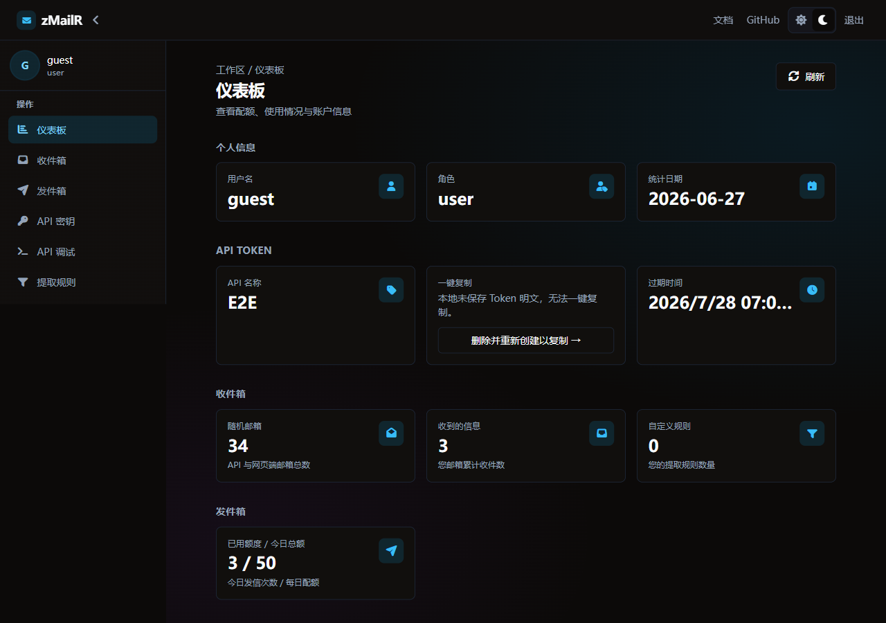
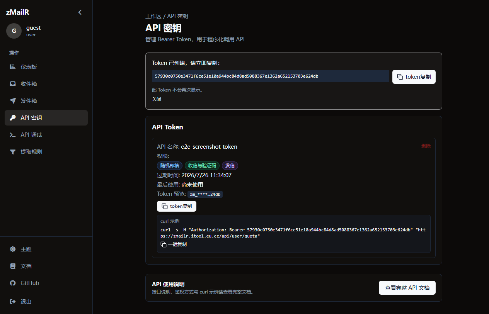
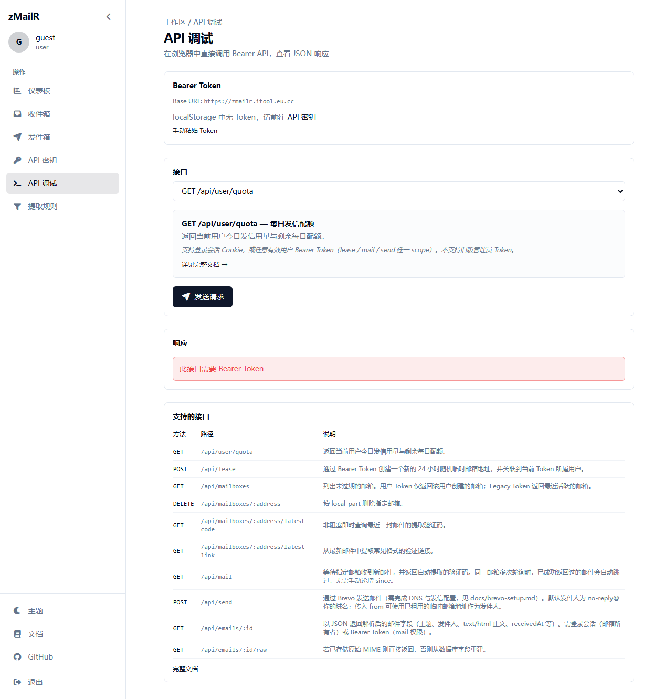

# 创建 API 密钥

> 图文教程：在 Dashboard 创建 Bearer Token，供脚本、CI、MCP 使用。

## 前提条件

- 已登录 zMailR（演示账号：<SiteLink to="/login">guest / guest</SiteLink>）
- 了解各 Scope 用途 → 见下文 [选择 Scope](#选择-scope)

---

## 步骤 1：进入 API 密钥页

1. 登录后打开 <SiteLink to="/dashboard/usage">仪表板</SiteLink>
2. 左侧菜单点击 **API 密钥**，或直接访问 <SiteLink to="/dashboard/api-keys">/dashboard/api-keys</SiteLink>



若尚无 Token，仪表板顶部会提示「请先创建 API Token」并引导至此页。

---

## 步骤 2：新建 Token

1. 点击 **新建 Token** / **创建 API 密钥**
2. 填写 **名称**（便于区分用途，如 `ci-otp`、`cursor-mcp`）
3. 选择 **过期天数**（可选，默认长期有效）
4. 勾选所需 **Scope**（见下表）
5. 点击 **创建**



---

## 选择 Scope {#选择-scope}

| Scope | 允许的操作 | 典型场景 |
|-------|------------|----------|
| **`lease`** | `POST /api/lease` 租用邮箱 | 自动化注册测试 |
| **`mail`** | 读信、列表、`GET /api/mail`、OTP 查询 | 收取验证码（**必选**） |
| **`send`** | `POST /api/send` 出站发信 | 发信测试（需 Brevo） |

::: tip 收 OTP 的最小组合
勾选 **`lease` + `mail`** 即可跑通「租邮箱 → 等验证码」全流程。
:::

Scope 与接口完整对照 → [认证说明 · Token Scope](./user-auth.md#token-scope)

---

## 步骤 3：复制并保存 Token

创建成功后，页面 **仅一次** 显示完整 Token（格式 `zmr_…`）。

1. 点击 **复制**
2. 存入密码管理器或 CI 密钥库
3. **勿** 提交到 Git 仓库

::: warning 安全提示
- 每位用户最多 **3 个** Token；满额须先删除旧 Token
- 服务端只存哈希，丢失明文无法找回
- Dashboard 可将副本存于浏览器 `localStorage`（按用户隔离），清缓存会丢失
:::

---

## 步骤 4：验证 Token

### 方式 A：API 调试页

Dashboard → **API 调试** → 选择 `GET /api/user/quota` → 发送。应返回 200 与配额 JSON。



### 方式 B：curl

```bash
curl -s "<SiteOrigin />/api/user/quota" \
  -H "Authorization: Bearer YOUR_TOKEN"
```

成功示例：

```json
{
  "success": true,
  "dailySendQuota": 50,
  "sentToday": 0,
  "remaining": 50,
  "unlimited": false
}
```

---

## 在脚本 / MCP 中使用

```bash
export ZMAILR_BASE_URL="<SiteOrigin />"
export ZMAILR_TOKEN="zmr_你的Token"
```

HTTP Header：

```http
Authorization: Bearer zmr_你的Token
```

MCP 环境变量 `ZMAILR_TOKEN` 填同一值 → [MCP 快速接入](./mcp.md)

---

## 常见问题

| 问题 | 处理 |
|------|------|
| `401` 未授权 | 检查 Header 格式、Token 是否过期 |
| `403` 缺少 xxx 权限 | 重建 Token 并勾选对应 Scope |
| 找不到明文 Token | 只能删除后重建 |

更多错误码 → [错误码与限流](./errors.md)

---

## 下一步

| 目标 | 文档 |
|------|------|
| 控制台完整体验 lease → OTP | [5 分钟体验](./quickstart-5min.md) |
| 写第一个自动化脚本 | [第一个脚本](./first-script.md) |
| Bearer / Session 详解 | [认证说明](./user-auth.md) |
