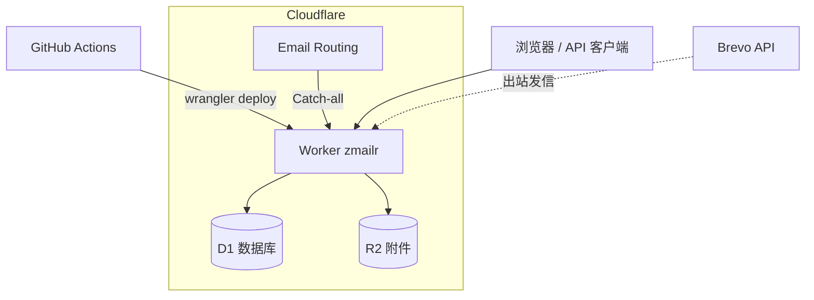

# 部署指南

> 将 zMailR 自托管到 **Cloudflare Workers + D1 + R2**，通过 GitHub Actions 自动发布。预计首次部署 **30～60 分钟**（含 DNS 与 Brevo 认证等待时间）。

## 你将完成什么

| 步骤 | 内容 | 预计耗时 |
|:----:|------|----------|
| 1 | Fork 仓库、创建 D1、配置 GitHub Secrets | 15 分钟 |
| 2 | 推送 `main` 触发 CI 部署 Worker | 5 分钟 |
| 3 | 绑定自定义域名 + Email Routing 收信 | 10 分钟 |
| 4 | （可选）Brevo 出站发信 | 15～30 分钟 |
| 5 | 部署后验证与管理后台初始化 | 10 分钟 |



::: tip 在线演示
本实例文档站：<SiteOrigin />/docs/ — 部署完成后你的站点结构相同（Worker 托管 SPA + `/docs/` 静态文档）。
:::

---

## 前置条件

- [Cloudflare](https://dash.cloudflare.com/) 账户
- 已托管在 Cloudflare 的域名（Worker 自定义域名 + Email Routing）
- GitHub 账户（Fork 仓库并配置 Actions Secrets）
- （可选）[Brevo](https://www.brevo.com/) 账户，用于 `/api/send` 出站发信

---

## 1. Fork 与 D1 数据库

1. Fork [jia0327/zmailr](https://github.com/jia0327/zmailr) 到你的 GitHub 账户。
2. Cloudflare Dashboard → **Workers & Pages** → **D1** → **Create database**。
3. 记录 **database_name** 与 **database_id**（部署 workflow 会写入 `wrangler.toml`）。

Schema 在 Worker **首次请求**时由 `ensureDatabaseInitialized` 自动执行（无需单独跑 `migrations/` 目录）。GitHub Actions 的 `wrangler deploy` 会按 `wrangler.toml` 绑定 D1。

::: warning 开发注意
D1 的 `db.exec()` 仅支持**单行** SQL；`worker/src/database.ts` 中所有 `CREATE TABLE` 须写在一行内，多行语句会导致初始化失败、全站返回「服务器内部错误」。
:::

---

## 2. GitHub Actions Secrets

在仓库 **Settings → Secrets and variables → Actions** 中添加：

| Secret | 必填 | 说明 |
|--------|------|------|
| `CF_API_TOKEN` | 是 | Cloudflare API Token（[创建](https://dash.cloudflare.com/profile/api-tokens)，使用 **Edit Cloudflare Workers** 模板，并附加 **Account → R2 → Edit** 以便 CI 自动创建附件 bucket） |
| `CF_ACCOUNT_ID` | 是 | Cloudflare 账户 ID（Workers 页面右侧） |
| `D1_DATABASE_ID` | 是 | D1 数据库 ID |
| `D1_DATABASE_NAME` | 是 | D1 数据库名称 |
| `VITE_EMAIL_DOMAIN` | 是 | 邮箱域名（逗号分隔多个）。**首次部署**时导入 D1；日常增删改请在管理后台 **域名** 标签操作 |
| `ADMIN_PASSWORD` | 是 | 管理后台登录密码（勿写入代码仓库） |
| `SESSION_SECRET` | 是 | 用户/管理后台 Session Cookie 的 HMAC 密钥，**须与 `ADMIN_PASSWORD` 独立**（推荐随机 32+ 字符） |
| `ADMIN_PATH` | 是 | 管理后台 URL 路径段，**推荐 UUID**，无 `/` 前缀（如 `a1b2c3d4-e5f6-7890-abcd-ef1234567890`） |
| `BREVO_API_KEY` | 否 | Brevo Transactional API Key（`xkeysib-...`），未配置时出站发信不可用 |
| `TURNSTILE_SITE_KEY` | 否 | Cloudflare Turnstile 站点公钥（与 `TURNSTILE_SECRET_KEY` 配对） |
| `TURNSTILE_SECRET_KEY` | 否 | Turnstile 私钥；启用后保护用户登录、**管理后台登录**、注册/重置发码 |
| `CORS_ALLOWED_ORIGINS` | 否 | 浏览器 SPA Origin 白名单，逗号分隔完整 URL（如 `https://mail.example.com`）；**不会**从 `VITE_EMAIL_DOMAIN` 自动推导 |

完整安全说明见 **[security.md](./security.md)**。用户发信配额在**管理后台 → 用户**配置；维护模式与请求监控见 [admin-guide.md](./admin-guide.md)。

### `SESSION_SECRET`

- 用于签发与校验 **用户** 与 **管理后台** 的 HttpOnly Session Cookie（HMAC-SHA256，24h）。
- 通过 `wrangler secret put SESSION_SECRET` 上传至 Worker；GitHub Actions 部署 workflow 会在检测到该 Secret 时自动上传。
- **未配置时**：登录与管理后台登录返回 **503**（`服务器未配置 SESSION_SECRET`），而非 401。
- 与 `ADMIN_PASSWORD` 分离，避免改管理密码时使全部在线 Session 失效；改密仍会 bump 对应用户的 `session_version` 使旧 Cookie 失效。

本地开发：在 `.dev.vars` 中设置（见 §8），与 `ADMIN_PASSWORD` 一并填写。

### `ADMIN_PATH` 要求

- **生产环境必填**：`.github/workflows/deploy.yml` 在 `ADMIN_PATH` 为空时会直接失败。
- 使用 **UUID 或足够随机的字符串**，避免可猜测路径（如 `admin`）。
- 访问 URL：`https://你的域名/{ADMIN_PATH}`。
- 错误路径返回 **404**，不暴露后台是否存在。
- 管理功能说明见 [admin-guide.md](./admin-guide.md)。

### `BREVO_API_KEY`

- 通过 `wrangler secret put BREVO_API_KEY` 上传至 Worker（workflow 自动执行）。
- 若拿到的是 Base64 JSON 而非明文 `xkeysib-...`，需先解码，见 [brevo-setup.md](./brevo-setup.md)。

---

## 3. 触发部署

推送至 **`main`** 分支即触发 [Deploy to Cloudflare](https://github.com/jia0327/zmailr/blob/main/.github/workflows/deploy.yml)；也可在 Actions 页手动运行 **Deploy to Cloudflare**。

Workflow 主要步骤：

1. `pnpm install` → `pnpm run build`（构建会生成 `frontend/public/openapi.json`，并打包 React 前端 + VitePress 文档到 `frontend/dist/docs/`）
2. 用 Secrets 替换 `wrangler.toml` 中的 `${D1_*}`、`${VITE_EMAIL_DOMAIN}`、`${ADMIN_PASSWORD}`、`${ADMIN_PATH}`、`${TURNSTILE_SITE_KEY}` 占位符
3. 若不存在则自动创建 R2 bucket `zmailr-attachments`（与 `wrangler.toml` 一致）
4. 上传 `SESSION_SECRET`（GitHub Secret 已配置时；未配置则告警，登录不可用）
5. （可选）上传 `BREVO_API_KEY`、`TURNSTILE_SECRET_KEY`
6. `wrangler deploy` 发布 Worker `zmailr`

部署后可通过 `GET /openapi.json` 与 `/api-docs` 查看 API 规范与文档，详见 [api.md](./api.md) 与 [user-auth.md](./user-auth.md)。

::: tip 绑定自定义域名
部署完成后，在 Cloudflare Workers 控制台为 Worker **绑定自定义域名**（如 `zmail.example.com`）。文档站路径为 `https://你的域名/docs/`。
:::

---

## 4. 入站邮件（Email Routing）

zMailR 通过 Cloudflare **Email Routing** 接收邮件：

1. Cloudflare Dashboard → 你的域名 → **Email** → **Email Routing** → 启用。
2. 添加 **Catch-all** 规则，操作选 **Send to a Worker**，指向已部署的 Worker（`zmailr`）。
3. **每个收信域名须单独完成上述步骤**（Catch-all → 同一 Worker），不能只配一个域名指望其它后缀也能收信。

Worker 使用 `postal-mime` 解析 MIME，按收件地址的 **local part** 匹配 D1 邮箱，并校验收件域名是否在管理后台 **已启用** 列表中；写入 D1 后按提取规则自动识别验证码。

### 多域名与后台配置

| 配置方式 | 说明 |
|----------|------|
| **管理后台 → 域名**（推荐） | 生产环境在 `{ADMIN_PATH}` 的 **域名** 标签添加、启用后缀；须勾选 Cloudflare Email Routing 与 Brevo 认证已完成。详见 [admin-guide.md § 邮箱域名管理](./admin-guide.md#邮箱域名管理)。 |
| **`VITE_EMAIL_DOMAIN`** | 首次部署时作为 **种子** 写入 D1；之后以前台 `GET /api/config` → `emailDomains`（来自 D1 已启用域名）为准。 |

用户在前端切换域名下拉时，复制的是 `前缀@所选域名`。验证码/通知邮件必须发往该 **完整地址**，且对应域名须已完成 Cloudflare Email Routing；否则邮件到不了 Worker。

---

## 5. 出站发信（Brevo）

`/api/send` 与 Dashboard 发件箱**仅**通过 [Brevo](https://www.brevo.com/) Transactional API 发信（需 `BREVO_API_KEY`，无其它回退通道）。完整步骤（注册、SPF/DKIM/DMARC、API Key、GitHub Secret）见 **[brevo-setup.md](./brevo-setup.md)**。

多域名时，**每个发信后缀**须在 Brevo 单独完成域名认证，并在管理后台 **域名** 页添加启用。

---

## 6. R2 附件存储（推荐）

入站邮件附件默认写入 R2，D1 仅存元数据（文件名、MIME、大小、`r2_key`）。历史仅存于 D1 的附件在下载时自动回退读取。

1. GitHub Actions 会在部署前自动创建 bucket `zmailr-attachments`（需 `CF_API_TOKEN` 含 R2 Edit 权限）
2. 也可手动在 Cloudflare Dashboard → **R2** → **Create bucket**，名称须与 `wrangler.toml` 中 `bucket_name` 一致
3. **无需填写 bucket ID**：`wrangler.toml` 仅配置 `binding = "ATTACHMENTS"` 与 `bucket_name`；`wrangler deploy` 会自动绑定 Worker → R2
4. 无需在 GitHub Secrets 中添加 R2 相关项

本地开发：同样创建 bucket（名称 `zmailr-attachments`），`wrangler dev` 会使用 `preview_bucket_name`。

---

## 7. MCP 集成（可选）

若需在 Cursor / Claude Desktop 中通过 AI 助手调用 zMailR API，可配置 npm 包 **`@zmailr/mcp`**。需先在 Dashboard → **API 密钥** 创建 Bearer Token，再设置 `ZMAILR_BASE_URL` 与 `ZMAILR_TOKEN` 环境变量。

完整工具列表与 Cursor 配置见 **[mcp.md](./mcp.md)**。MCP 为客户端可选组件，**不影响 Worker 部署**。

---

## 8. 本地开发

1. 复制环境变量模板：

   ```bash
   cp .dev.vars.example .dev.vars
   ```

2. 编辑 `.dev.vars`（**勿提交**）：

   ```env
   ADMIN_PASSWORD=change-me
   SESSION_SECRET=change-me-session-secret
   LOCAL_DEV=1
   ADMIN_PATH=admin
   # BREVO_API_KEY=xkeysib-...   # 可选，本地测发信
   ```

3. 本地 D1 与启动：

   ```bash
   pnpm install   # 自动配置 git hooks（prepare 脚本）
   pnpm run build
   pnpm exec wrangler dev
   ```

   未设置 `ADMIN_PATH` 时，本地管理后台默认为 `http://localhost:8787/admin`。

   本地 OpenAPI：`http://localhost:8787/openapi.json`。  
   本地文档：`http://localhost:8787/docs/`。

4. 前端热更新（可选）：

   ```bash
   cd frontend && pnpm dev
   ```

---

## 9. 部署后验证

按顺序检查：

1. **健康检查** — `GET /api/public/status` 返回 `status: "ok"`，且 `checks.d1.ok`、`checks.r2.ok` 为 `true`。
2. **配置接口** — `GET /api/config` 返回 200（若全站 500，检查 Worker 日志中的 D1 初始化错误）。
3. **文档站** — 访问 `https://你的域名/docs/`，确认部署教程等页面可打开。
4. **控制台登录** — `https://你的域名/login`；生产环境请禁用或删除默认 `guest` 演示账号（见 [security.md](./security.md)）。
5. **API 密钥** — Dashboard → **API 密钥** 创建 Bearer Token（所有程序化 API 均需 Bearer，不支持匿名）。
6. **OpenAPI** — 确认 `https://你的域名/openapi.json` 与 `/api-docs` 可访问。
7. **管理后台** — `https://你的域名/{ADMIN_PATH}`，使用 `ADMIN_PASSWORD` 登录（启用 Turnstile 时需完成人机验证）。
8. **API 脚本验证**（将 `<token>` 与域名替换为你的值）：

   ```bash
   pip install requests
   python scripts/verify_api.py \
     --base-url https://你的域名 \
     --token <your-bearer-token> \
     --send-test
   ```

9. （可选）按 [mcp.md](./mcp.md) 配置 `@zmailr/mcp` 供 Cursor 使用。

::: warning 生产安全清单
部署后务必完成 [security.md § 部署检查清单](./security.md#部署检查清单)：强随机 `ADMIN_PATH` / `SESSION_SECRET`、禁用 guest、Cloudflare HSTS 等。
:::

---

## 相关文档

| 文档 | 说明 |
|------|------|
| [文档首页](./) | 文档分类导航 |
| [api.md](./api.md) | API 端点速查 |
| [admin-guide.md](./admin-guide.md) | 管理后台、维护模式、请求监控、审计日志 |
| [brevo-setup.md](./brevo-setup.md) | Brevo 发信与 DNS 配置 |
| [user-auth.md](./user-auth.md) | 用户登录、API Token scope、per-user 速率限制 |
| [security.md](./security.md) | 安全模型、环境变量、部署检查清单 |
| [mcp.md](./mcp.md) | MCP 集成（`@zmailr/mcp`） |
| [项目 README](https://github.com/jia0327/zmailr/blob/main/README.md) | 项目简介与效果图 |
