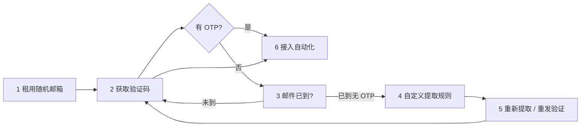

# 验证码完整流程

> 从 **租用随机邮箱 → 收取 OTP → 规则不匹配排查 → 自定义规则 → 重新提取 → 自动化接入** 的完整路径。

## 流程总览



| 步骤 | 做什么 | 控制台 | API |
|:----:|--------|--------|-----|
| 1 | 获得 24h 随机邮箱 | 收件箱 → 新建邮箱 | `POST /api/lease` |
| 2 | 读取 OTP | 收件箱 OTP 高亮 | `GET .../latest-code` 或 `GET /api/mail` |
| 3 | 确认「有信无码」 | 邮件在列表但无 OTP | 列表有信 + `404 no_code` |
| 4 | 按发件人域名配正则 | [提取规则](/dashboard/extract-rules) | Session：`POST /api/user/extract-rules` |
| 5 | 让旧信重新匹配规则 | 邮件详情 → 重新提取 | `POST /api/emails/:id/re-extract` |
| 6 | CI / Agent 稳定跑通 | — | [第一个脚本](./first-script.md) · [MCP](./mcp.md) |

---

## 步骤 1：租用随机邮箱

**目标**：拿到一个 24 小时有效的临时地址，供目标站点发送验证邮件。

### 控制台

1. <SiteLink to="/login">登录</SiteLink> → **收件箱** → **新建邮箱**


### API

```bash
curl -s -X POST "<SiteOrigin />/api/lease" \
  -H "Authorization: Bearer YOUR_TOKEN"
```

响应中的 `email` 即完整地址，例如 `k7m2x9@your-mail-domain`。

---

## 步骤 2：获取验证码

**目标**：在目标站点填写上一步邮箱并触发验证邮件后，拿到 OTP。

### 控制台

打开对应收件箱，验证邮件到达后，正文中的 OTP 会 **自动高亮**：


### API — 两种方式

| 方式 | 接口 | 适用 |
|------|------|------|
| **长轮询** | `GET /api/mail?to=...&require_code=true` | 脚本一条命令等 OTP |
| **即时查询** | `GET /api/mailboxes/:address/latest-code` | 自己控制轮询间隔 |

```bash
# 长轮询（最长约 55s）
curl -s -G "<SiteOrigin />/api/mail" \
  -H "Authorization: Bearer YOUR_TOKEN" \
  --data-urlencode "to=k7m2x9@your-mail-domain" \
  --data-urlencode "timeout=60" \
  --data-urlencode "require_code=true"

# 即时查询
curl -s "<SiteOrigin />/api/mailboxes/k7m2x9@your-mail-domain/latest-code" \
  -H "Authorization: Bearer YOUR_TOKEN"
```

---

## 步骤 3：收到邮件，但未获取到验证码

**现象**：收件箱里 **能看到邮件**，但 API 返回 `404 no_code`，或长轮询最终 `408 timeout`。

### 先区分两种 404

| `error` | 含义 | 处理 |
|---------|------|------|
| `no_email` | 邮件 **尚未到达** | 继续轮询 / 增大 `timeout` |
| `no_code` | 邮件 **已到**，但 **未提取出 OTP** | 进入步骤 4（规则不匹配） |

::: warning 长轮询的陷阱
`GET /api/mail` 在 `require_code=true` 时，只返回 **已提取 OTP** 的邮件。若信已到但规则未匹配，会一直等到 **408 timeout**，即使收件箱里已有该邮件。
:::

### 如何确认「有信无码」

**控制台**：邮件列表有记录，但无 OTP 徽章 / 高亮。

**API**：先列邮件，再看 `extractedCode` 是否为空：

```bash
curl -s "<SiteOrigin />/api/mailboxes/k7m2x9@your-mail-domain/emails" \
  -H "Authorization: Bearer YOUR_TOKEN"
```

若 `emails[0]` 存在且 `extractedCode` 为 `null`，说明 **提取规则未匹配**，不是邮件延迟。

---

## 步骤 4：自定义提取规则

**原因**：默认规则覆盖常见格式（关键词 + 6 位数字等），部分站点模板特殊，需按 **发件人域名** 增加正则。

### 控制台（推荐）

1. 打开 <SiteLink to="/dashboard/extract-rules">提取规则</SiteLink>
2. 点击 **新建规则**
3. 填写：

| 字段 | 示例 | 说明 |
|------|------|------|
| **域名** | `example.com` 或 `*` | 匹配 `From` 地址的域名；`*` 表示全部 |
| **正则** | `验证码[：:]\s*(\d{6})` | 必须含 **捕获组** `(...)`，提取第一组 |
| **优先级** | `10` | 数字越大越优先 |
| **备注** | `某站注册邮件` | 便于维护 |


::: tip 从邮件页快捷跳转
收件箱打开某封未提取 OTP 的邮件，可点击 **配置提取规则**，自动带入发件人域名。
:::

### 规则优先级（简记）

1. **你的自定义规则**（按发件人域名 + priority）
2. **全局规则**（管理员配置）
3. **内置兜底**（关键词 + 6 位数字等）

图文详解 → [自定义提取规则](./extract-rules.md)

---

## 步骤 5：重新发送 / 重新提取

规则保存后，系统会 **后台批量重跑** 尚未提取 OTP 的历史邮件。也可手动触发：

### 方式 A：目标站点「重新发送验证码」

在目标网站点击 **重发验证邮件**，新邮件会再次走提取流程（规则已更新则直接成功）。

### 方式 B：控制台「重新提取」

在 **邮件详情** 或列表中点击 **重新提取**，对已有邮件按最新规则再跑一遍。

### 方式 C：API 重新提取

```bash
# 将 EMAIL_ID 换为步骤 3 列表中的 id
curl -s -X POST "<SiteOrigin />/api/emails/EMAIL_ID/re-extract" \
  -H "Authorization: Bearer YOUR_TOKEN"
```

成功时响应 `email.extractedCode` 非空。然后再调 `latest-code`：

```bash
curl -s "<SiteOrigin />/api/mailboxes/k7m2x9@your-mail-domain/latest-code" \
  -H "Authorization: Bearer YOUR_TOKEN"
```

### 方式 D：自测发信（可选）

实例已配置 Brevo 时，可用 `POST /api/send` 向租用的邮箱发一封含 OTP 的测试信（需 `send` scope）。详见 [API 参考 · 出站发信](./api.md#出站发信-post-apisend)。

---

## 步骤 6：接入自动化

规则稳定后，把流程写进 CI 或 Agent。

### 推荐脚本逻辑

```
lease → 目标站点填 email → 长轮询 wait OTP
  ├─ 200 + code → 成功
  ├─ 408 timeout → 列邮件
  │     ├─ 无邮件 → 重试 / 报错「邮件未到」
  │     └─ 有邮件无 extractedCode → 报错「需配置提取规则」或人工介入
  └─ 404 no_code → 短轮询继续 或 触发 re-extract 后再查
```

Python / Node 模板 → [脚本接入](./scripting.md) · 最小示例 → [第一个脚本](./first-script.md)

### MCP（Cursor / Claude）

配置 `@zmailr/mcp` 后，Agent 可调用 `lease_mailbox` → `wait_for_mail` → `get_latest_code`。规则需在 Dashboard 预先配好（MCP 无单独「写规则」工具）。

→ [MCP 快速接入](./mcp.md)

### 自动化前检查清单

- [ ] Token Scope：`lease` + `mail`
- [ ] 目标站点发件域名已配提取规则（或确认默认规则能匹配）
- [ ] 脚本区分 `no_email` / `no_code` / `timeout`
- [ ] 规则变更后调用 `re-extract` 或依赖站点重发

---

## 下一步

| 目标 | 文档 |
|------|------|
| 提取规则字段与示例 | [自定义提取规则](./extract-rules.md) |
| 完整 Python 模板 | [脚本接入](./scripting.md) |
| 错误码速查 | [错误码与限流](./errors.md) |
| Cursor 配置 | [MCP 快速接入](./mcp.md) |
