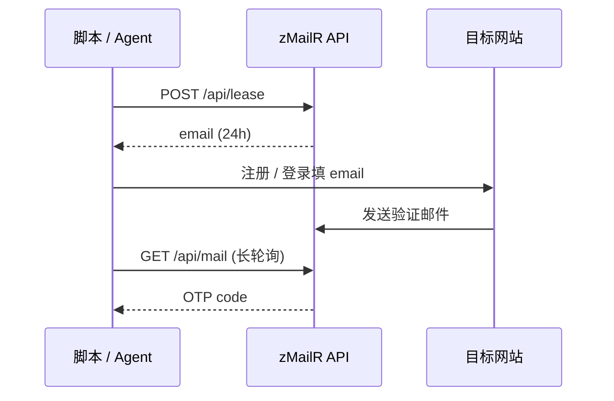

# 产品概述

> 本文介绍 zMailR 是什么、能做什么、以及 REST 与 MCP 两种接入方式。

## 什么是 zMailR？

**zMailR** 是开源的 **真实 MX 临时邮箱** 服务，内置 **OTP 自动提取**，面向：

- **自动化测试** — 注册/登录流程中自动收取验证码
- **CI/CD** — 流水线里租用邮箱、断言 OTP
- **AI Agent** — Cursor / Claude 通过 MCP 调用，无需手写 HTTP

本实例地址：<SiteOrigin />

::: tip 演示账号
未注册也可体验：<SiteLink to="/login">登录页</SiteLink> 使用 `guest` / `guest`。
:::

---

## 核心能力

| 能力 | 说明 |
|------|------|
| **临时收件箱** | 每个邮箱 **24 小时**有效，到期自动失效 |
| **OTP 提取** | 收信时按规则从正文提取验证码（如 6 位数字） |
| **REST API** | Bearer Token 鉴权，适合脚本与 CI |
| **MCP 工具** | 11 个工具封装 REST，适合 Cursor / Claude Desktop |
| **出站发信** | 可选 Brevo 集成，需 `send` scope |

---

## 典型工作流

1. **租用邮箱** — `POST /api/lease` 获得随机地址
2. **触发验证** — 在目标站点填写该邮箱
3. **收取 OTP** — 长轮询 `GET /api/mail` 或轮询 `latest-code`

---

## 三种接入方式

| 方式 | 适合谁 | 文档 |
|------|--------|------|
| **控制台** | 手动体验、调试 | [5 分钟体验](./quickstart-5min.md) |
| **REST / 脚本** | Python、Node、curl、CI | [脚本接入](./scripting.md) |
| **MCP** | Cursor、Claude Desktop | [MCP 快速接入](./mcp.md) |

三种方式共用同一 **Bearer Token** 与 Base URL，无额外 MCP 端点。

---

## 核心 API（速览）

| 接口 | 作用 |
|------|------|
| `POST /api/lease` | 分配 24h 临时邮箱 |
| `GET /api/mail` | 长轮询等待 OTP（最长 ~55s） |
| `GET .../latest-code` | 非阻塞查最新 OTP |
| `POST /api/send` | 出站发信（需 Brevo） |

完整端点表与选型 → [API 概览](./api-overview.md) · 逐条参数 → [API 参考](./api.md)

---

## 鉴权概要

- **不支持匿名 API** — 所有程序化调用须 `Authorization: Bearer <token>`
- **Scope** — `lease`（租邮箱）、`mail`（读信/OTP）、`send`（发信）
- 收 OTP 至少勾选 **`lease` + `mail`**

详情 → [认证说明](./user-auth.md) · 图文创建 Token → [创建 API 密钥](./create-api-key.md)

---

## 下一步

| 你想… | 继续阅读 |
|-------|----------|
| 5 分钟在控制台跑通 lease → OTP | [5 分钟体验](./quickstart-5min.md) |
| 创建 Bearer Token | [创建 API 密钥](./create-api-key.md) |
| 写 Python / curl 脚本 | [第一个脚本](./first-script.md) |
| 配置 Cursor MCP | [MCP 快速接入](./mcp.md) |
