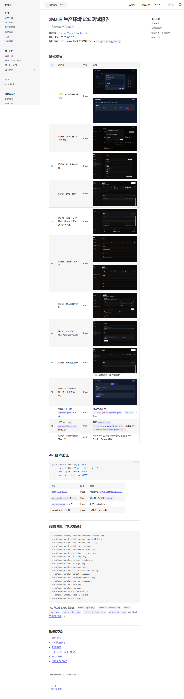

# zMailR 生产环境 E2E 测试报告

> **文档导航** → [文档首页](./)

**测试站点**：https://zmailr.itool.eu.cc/  
**测试日期**：2026-06-26  
**测试方式**：YSbrowser MCP 浏览器自动化 + `scripts/verify_api.py` + curl  
**演示账号**：`guest` / `guest`

## 功能清单（Feature Checklist）

| 区域 | 功能点 | 说明 |
|------|--------|------|
| **Auth** | 登录 / 登出 | Session Cookie，受保护路由 |
| | API Token | Dashboard → API 密钥，1 个/用户，scope：`lease` / `mail` / `send` |
| | 无匿名 API | 未带 Bearer 时 `POST /api/lease`、`GET /api/mail` 等返回 401 |
| **Inbox** | 新建收件箱 | 24h 临时地址 |
| | 收信 + OTP 高亮 | OtpBox 提取与列表高亮 |
| | 附件列表/预览/下载 | Session 鉴权；需入站含附件邮件 |
| | 邮箱历史 / 分页 | 历史地址切换、批量删除 |
| **Outbox** | 撰写（纯文本 / 富文本） | 正文 Tab 切换；富文本编辑器 |
| | 出站附件 | 多文件上传（Brevo） |
| | 发信记录 / 详情 | 列表分页；点击查看详情弹窗 |
| | 失败重发 | 详情内「重新发送」（需失败记录触发） |
| **API** | `POST /api/lease` | 租用临时邮箱 |
| | `GET /api/mail` | 长轮询收信 / OTP |
| | `POST /api/send` | Brevo 出站（同域回环测试） |
| | `GET /api/user/quota` | 日发信配额与用量 |
| **Dashboard** | 用量统计 | 收件/发件/配额 StatCard |
| | 提取规则 | 系统内置 + 用户自定义 |
| | API 调试 | 浏览器内调用 Bearer API，查看 JSON 与限流头 |
| **Admin** | 运营统计 / Brevo | 用户、邮箱、收发信汇总 |
| | 系统健康 | D1 / R2 / Brevo 依赖探测（`GET /api/public/status`） |
| | 请求监控 | 近 7 日趋势图、状态码分布、Top 路由、429 Top IP/用户 |
| | 用户 / 公告 / 规则 | CRUD 与启用状态 |
| | 系统设置 | 维护模式、Legacy Token 配额 |
| | 审计日志 | 按日期筛选 |
| **Docs** | `/docs/` | VitePress 文档站 |
| | `/docs/testing` | 本测试报告 |
| | `/docs/api-interactive` | 交互式 API 文档 |
| | `/openapi.json` | 机器可读 OpenAPI |
| **MCP** | `@zmailr/mcp` | npm **尚未发布**；见 [mcp.md](./mcp.md) 本地 monorepo 配置 |
| **Ops** | `GET /api/health` | 静态 `{ status: "ok" }` |
| | `GET /api/public/status` | D1/R2/Brevo 依赖探测 + 维护模式 |
| | D1 备份 | [backup.md](./backup.md) — `scripts/backup-d1-to-r2.mjs` |

> **管理后台说明**：生产 `ADMIN_PATH` + `ADMIN_PASSWORD` 未在本地配置。下列 Admin 项沿用 **2026-06-26 前次 E2E 历史截图**（`docs/screenshots/admin-*.png`），本次未重新登录后台；**#12 公开状态 API** 与 **#18 系统健康 UI** 以 curl/API 结果为准。

## 测试结果

| # | 测试项 | 结果 | 截图 |
|---|--------|------|------|
| 1 | 用户端 · guest 登录 | Pass |  |
| 2 | 用户端 · 仪表板用量 | Pass |  |
| 3 | 用户端 · API Token 创建 | Pass |  |
| 4 | 用户端 · 新建收件箱 | Pass |  |
| 5 | 用户端 · 收信 + OTP 高亮 | Pass |  |
| 6 | 用户端 · 邮箱历史列表 | Pass |  |
| 7 | 用户端 · 发件箱 UI 发信 | Pass | <br> |
| 8 | 用户端 · 发件箱富文本 Tab | Pass |  |
| 9 | 用户端 · 发信详情弹窗 | Pass |  |
| 10 | 用户端 · 自定义提取规则 | Pass |  |
| 11 | 用户端 · API 调试 GET /api/user/quota | Pass |  |
| 12 | 公开 API · `GET /api/public/status` 依赖探测 | **Fail** | curl 返回 `500` / `{"success":false,"error":"服务器内部错误"}`；期望 `success: true` 且 `checks.d1`/`checks.r2.ok: true` |
| 13 | 用户端 · 收件箱附件列表与下载 | 待测 | 本次无入站含附件测试邮件；功能已实现，需 Email Routing 投递带附件邮件后复测 |
| 14 | 用户端 · 失败发信重发 | 待测 | 需 Brevo 失败记录触发；UI 已实现 `SentEmailDetailModal` 重发按钮 |
| 15 | 匿名 API · 无 Token 拒绝 | Pass | `POST /api/lease`、`GET /api/mail` → HTTP 401 |
| 16 | OpenAPI · `GET /openapi.json` | Pass | HTTP 200；构建产物同步至 `frontend/public/openapi.json` |
| 17 | 文档 · `/docs/` 首页 | Pass |  |
| 18 | 文档 · `/docs/testing` | Pass |  |
| 19 | 文档 · `/docs/api-interactive` | Pass |  |
| 20 | 管理后台 · 创建并启用公告 | Pass（历史截图） | <br> |
| 21 | 管理后台 · 系统健康 + 运营统计 | Fail（API）/ 未复测（UI） | 公开 `GET /api/public/status` 500；仪表盘健康区块依赖同接口，见 [admin-dashboard.png](./screenshots/admin-dashboard.png) 历史截图 |
| 22 | 管理后台 · 请求监控图表 | Pass（历史截图） |  |
| 23 | 管理后台 · 用户 / 规则 / 设置 / 审计 | Pass（历史截图） |  ·  ·  ·  |
| 24 | Ops · `GET /api/health` | Pass | `{"status":"ok","message":"临时邮箱系统API正常运行"}` |
| 25 | MCP · `@zmailr/mcp` | 文档就绪 | npm 未发布；见 [mcp.md](./mcp.md) |
| 26 | Ops · D1 备份脚本 | 文档就绪 | 见 [backup.md](./backup.md) |

## API 脚本验证

```bash
python scripts/verify_api.py \
  --base-url https://zmailr.itool.eu.cc \
  --token "<guest Bearer Token>" \
  --send-test --test-code 847291
```

| 步骤 | 结果 | 说明 |
|------|------|------|
| `POST /api/lease` | Pass | 租约邮箱（如 `gcy71scff4@itool.eu.cc`） |
| `POST /api/send` 同域回环 | Pass | 测试邮件含 OTP `847291` |
| `GET /api/mail` 长轮询 | Pass | ~4.3s 内返回 code |
| Web 收件箱 OTP 列 | Pass | UI 高亮与 API 一致 |

## 截图清单（本次更新）

```
docs/screenshots/login.png
docs/screenshots/dashboard.png
docs/screenshots/inbox-new-mailbox.png
docs/screenshots/inbox-with-otp.png
docs/screenshots/inbox.png
docs/screenshots/api-keys-create.png
docs/screenshots/outbox-send.png
docs/screenshots/outbox-rich-text.png
docs/screenshots/outbox-sent.png
docs/screenshots/outbox-sent-detail.png
docs/screenshots/api-debug-response.png
docs/screenshots/extract-rules-custom.png
docs/screenshots/docs-home.png
docs/screenshots/docs-testing.png
docs/screenshots/api-interactive.png
```

（管理后台历史截图：`admin-login.png`、`admin-dashboard.png`、`admin-announcements*.png`、`admin-users.png`、`admin-rules.png`、`admin-ratelimit.png`、`admin-settings.png`、`admin-audit.png` 等。）

## 相关文档

- [文档首页](./)
- [API 快速参考](./api.md)
- [部署指南](./deploy.md)
- [用户认证与 API Token](./user-auth.md)
- [MCP 集成](./mcp.md)
- [D1 备份](./backup.md)
- [项目 README](https://github.com/jia0327/zmailr/blob/main/README.md)
