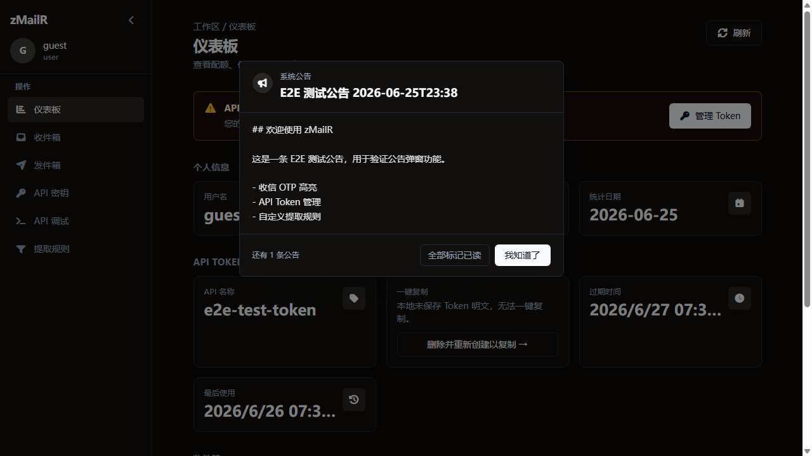

# zMailR 生产环境 E2E 测试报告

> **文档导航** → [文档首页](./)

**测试站点**：https://zmailr.itool.eu.cc/  
**测试日期**：2026-06-26  
**测试方式**：YSbrowser MCP 浏览器自动化 + `scripts/verify_api.py`

## 测试结果

| # | 测试项 | 结果 | 截图 |
|---|--------|------|------|
| 1 | 管理后台 · 创建并启用公告 | Pass | <br> |
| 2 | 用户端 · guest 登录后公告弹窗 | Pass |  |
| 3 | 用户端 · API Token 创建 | Pass |  |
| 4 | 用户端 · 新建收件箱 | Pass |  |
| 5 | 用户端 · 收信 + OTP 高亮（收件箱向下滚动至邮件列表） | Pass |  |
| 6 | 用户端 · 发件箱 UI 发信 | Pass | <br> |
| 7 | 用户端 · 自定义提取规则 | Pass |  |
| 8 | 用户端 · API 调试 GET /api/user/quota | Pass |  |
| 9 | 用户端 · 邮箱历史列表 | Pass | （历史列表可见，可切换地址） |
| 10 | 管理后台 · 系统设置 UI（未启用维护模式） | Pass |  |
| 11 | OpenAPI · `GET /openapi.json` 可访问 | Pass | 构建产物同步至 `frontend/public/openapi.json`；`/api-docs` 含链接 |
| 12 | 公开 API · `GET /api/public/status` 依赖探测 | 待测 | 期望 `status: "ok"`，`checks.d1`/`checks.r2.ok: true`；未配 Brevo 时 `checks.brevo.configured: false` |
| 13 | 用户端 · 收件箱附件列表与下载 | 待测 | 含附件邮件在详情页展示列表、预览与下载；Session Cookie 鉴权 |

## API 脚本验证

```bash
python scripts/verify_api.py \
  --base-url https://zmailr.itool.eu.cc \
  --token "<guest Bearer Token>" \
  --send-test --test-code 847291
```

| 步骤 | 结果 | 说明 |
|------|------|------|
| `POST /api/lease` | Pass | 租约邮箱 `6it7e9mu230@itool.eu.cc` |
| `POST /api/send` 同域回环 | Pass | 测试邮件含 OTP `847291` |
| `GET /api/mail` 长轮询 | Pass | 4.23s 内返回 code |
| Web 收件箱 OTP 列 | Pass | UI 高亮与 API 一致 |

## 截图清单（本次更新）

```
docs/screenshots/admin-announcement-create.png
docs/screenshots/admin-announcements-list.png
docs/screenshots/admin-announcements.png
docs/screenshots/admin-settings.png
docs/screenshots/announcement-modal.png
docs/screenshots/api-debug-response.png
docs/screenshots/api-debug.png
docs/screenshots/api-keys-create.png
docs/screenshots/api-keys.png
docs/screenshots/dashboard.png
docs/screenshots/extract-rules-custom.png
docs/screenshots/extract-rules.png
docs/screenshots/inbox-new-mailbox.png
docs/screenshots/inbox-with-otp.png
docs/screenshots/inbox.png
docs/screenshots/login.png
docs/screenshots/outbox-send.png
docs/screenshots/outbox-sent.png
docs/screenshots/outbox.png
```

（另有历史管理后台截图：`admin-login.png`、`admin-dashboard.png`、`admin-users.png`、`admin-rules.png`、`admin-ratelimit.png`、`admin-audit.png` 等，见 [项目 README](https://github.com/jia0327/zmailr/blob/main/README.md)。）

## 相关文档

- [文档首页](./)
- [API 快速参考](./api.md)
- [部署指南](./deploy.md)
- [用户认证与 API Token](./user-auth.md)
- [MCP 集成](./mcp.md)
- [项目 README](https://github.com/jia0327/zmailr/blob/main/README.md)
